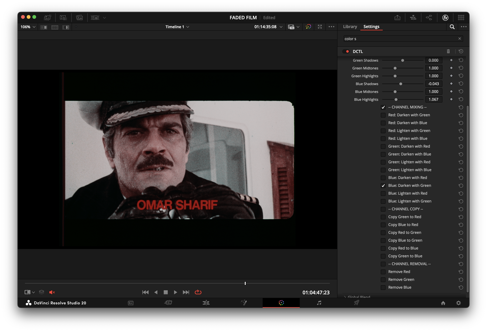

# FadedBalancerOFX

  
  
  

  
  

  <a href="docs/BACKGROUND_FILM_FADING.md">Background & Science</a> •
  <a href="docs/presets_companion.md">Presets Companion</a> •
  <a href="docs/FAQ.md">FAQ</a>

A DaVinci Resolve DCTL OFX plugin for balancing RGB channels and correcting faded film scans. It provides accessible and flexible tools for channel adjustment, mixing, and restoration preparation.

---

### Version

**Current: v1.4.0** (previous public base was v1.3.0; earlier versions in `previous_versions/`)

#### What's New in v1.4.0
- Added non-destructive preset system (10 starter corrective presets; toggling back to None restores baseline UI state).
- Internal pipeline clarified (see Pipeline section) – ordering unchanged from spec; presets occur before global stage.
- Minor doc clarifications; no processing math changes versus v1.3.0.

#### What's New in v1.3.0
- Added `Preserve Luminance` (⚖) – normalizes luma after per-channel stage only (global adjustments still shift exposure).
- Renamed channel "Copy" operations to clearer **Replace** (e.g. "Replace Red → With Green").
- Locked processing order: Global → Fade Correction → Per-Channel → Mixing → Replace → Removal → Output.
- Consolidated UI/label/icon overhaul (option text simplification, Darken/Lighten composite combos, consistent icon set, duplicate definitions removed).

#### What's New in v1.2.0
- Removed final hard clamp to preserve full floating-point range during grading.
- Added `Output to Cineon Log` checkbox to inspect and balance channels safely without clipping.
- Added per-channel Offset controls (Red/Green/Blue) for finer pre-lift channel alignment.

---

### Features

-   **Film Fade Correction:** A dedicated tool to correct faded footage by adaptively enhancing contrast and saturation.
-   **Global & Per-Channel Balance:** Adjust Lift, Gamma, and Gain for all channels together or individually.
-   **Preserve Luminance (⚖):** Optional re-normalization of luma after per-channel adjustments.
-   **Channel Mixing:** Min/Max composites (e.g., `Red = min(Red, Green)` or `Blue = max(Blue, Green)`).
-   **Channel Replace & Removal:** Replace a channel's data with another or remove a channel entirely.
-   **Optional Cineon Output:** Linear → Cineon-like log inspection mode.
-   **Presets (v1.4.0):** Non-destructive internal presets. See `docs/presets_companion.md` for details.

---

### Pipeline (Processing Order)

The image is processed through the following steps in a fixed order:

1.  **🎨 Preset Application** (Internal temporary variables only)
2.  **🌍 Global Adjust** (Offset / Shadows / Midtones / Highlights)
3.  **✨ Fade Correction** (Contrast + Saturation nudge)
4.  **🎨 Per-Channel Adjust** (R/G/B)
5.  **⚖️ Optional Preserve Luminance** (Post per-channel only)
6.  **🔄 Mixing** (Darken / Lighten via min/max)
7.  **➡️ Replace** (Explicit channel copy)
8.  **❌ Removal** (Zero out channels)
9.  **📜 Optional Output to Cineon Log**

*Identity: Defaults with preset=None produce output ≈ input (floating point tolerance).*

---

### Before & After

Here are a few examples showcasing the plugin's effectiveness in correcting faded film scans.

**Example 1: Captain Scene**

| Before | After |
| :---: | :---: |
|  |  |

**Example 2: Beach Scene**

| Before | After |
| :---: | :---: |
|  |  |

**Example 3: Table Scene**

| Before | After |
| :---: | :---: |
|  |  |

---

### Installation

1.  Download `FadedBalancerOFX.dctl`.
2.  Place it in your DaVinci Resolve LUT folder:
	-   **Windows:** `C:\ProgramData\Blackmagic Design\DaVinci Resolve\Support\LUT\`
	-   **macOS:** `/Library/Application Support/Blackmagic Design/DaVinci Resolve/LUT/`
3.  Restart DaVinci Resolve.
4.  In the Color page, add a "DCTL" effect to a node and select `FadedBalancerOFX` from the dropdown menu.

---

### Video Demonstration

For a visual guide on how to use the plugin, check out the video tutorial below:

---

### Community & Support

-   **Discussions:** Have a question, an idea, or want to share your work? [Join the community discussions!](https://github.com/OWNER/Faded-Balancer-DCTL/discussions)
-   **Contact:** For direct inquiries, you can reach out via [Email](mailto:info@fabiocolor.com) or connect on [Instagram](https://www.instagram.com/fabiocolor), [LinkedIn](https://www.linkedin.com/in/fabiobedoya/), or [YouTube](https://www.youtube.com/@fabiocolor).

If you find this plugin useful and would like to support its ongoing development, please consider making a donation. Your support is greatly appreciated!

  
  

---

### Acknowledgements

The "Film Fade Correction" feature was partially inspired by insights from the following paper:
-   Trumpy, G., Flueckiger, B., & Goeth, A. (2023). *Digital Unfading of Chromogenic Film Informed by Its Spectral Densities*. [Link to paper](https://ntnuopen.ntnu.no/ntnu-xmlui/handle/11250/3101572)

---

### License

[MIT License](LICENSE)
