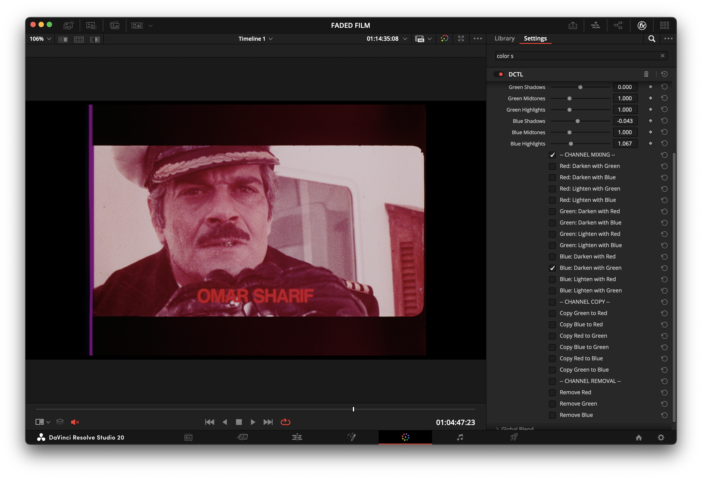
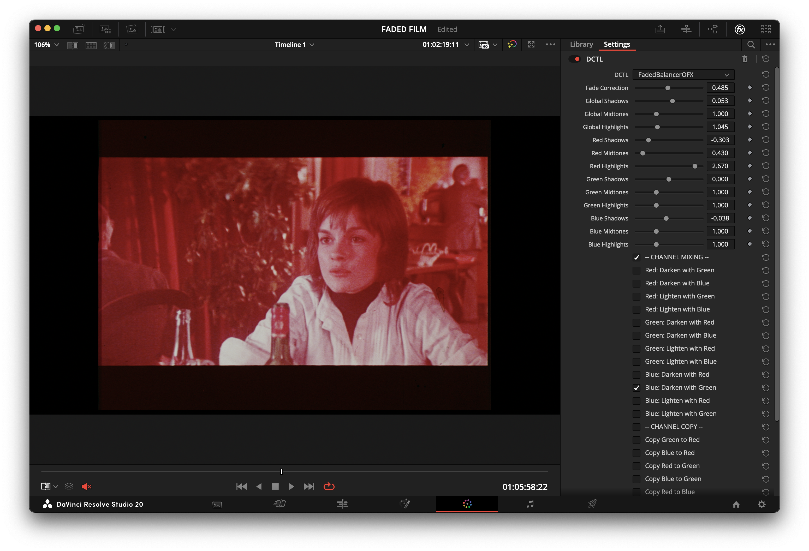
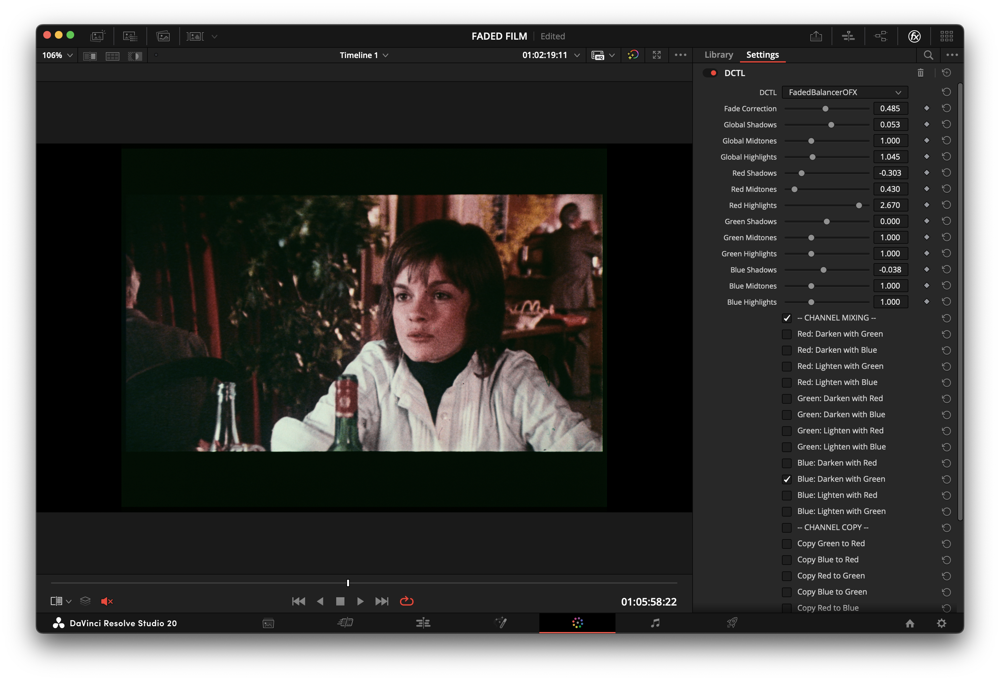

# FadedBalancerOFX

A DaVinci Resolve DCTL OFX plugin focused on corrective balancing of faded / dye-shifted film scans. It provides precise, minimal, and invertible channel tools (global + per-channel LGGH, min/max mixing, replace, removal, optional Cineon log inspection) to neutralize classic magenta / purple casts without imposing a stylized look.

Synopsis: A quick, conservative corrective pass for faded chromogenic film scans — use presets and the Fade Correction scalar to recover midtone contrast and rebalance neutral drift, then refine with per-channel controls. See the project FAQ for a short quickstart and a visual scope checklist for verification.

---

### Version

**v1.3.1**
-   **macOS:** Fully compatible.
-   **Windows:** Fully compatible.
-   **Linux:** Not yet tested.

#### What's New in v1.3.0
- Added `Preserve Luminance` (⚖) – normalizes luma after per-channel stage only (global adjustments still shift exposure).
- Renamed channel "Copy" operations to clearer **Replace** (e.g. "Replace Red → With Green").
- Processing order is canonical and should not be changed without owner approval.
- Consolidated UI/label/icon overhaul (option text simplification, Darken/Lighten composite combos, consistent icon set, duplicate definitions removed).

#### What's New in v1.2.0
- Removed final hard clamp to preserve full floating-point range during grading.
- Added `Output to Cineon Log` checkbox to inspect and balance channels safely without clipping.
- Added per-channel Offset controls (Red/Green/Blue) for finer pre-lift channel alignment.

---

### Features (Shipped)

- **Fade Correction Scalar:** Subtle contrast/saturation nudge for faded scans (does not invent chroma).
- **Global & Per-Channel Lift/Gamma/Gain (LGGH):** Offset, Shadows, Midtones (gamma), Highlights controls for overall and per-channel balancing.
- **Preserve Luminance (⚖):** Optional Rec.709 Y rescale after per-channel adjustments.
- **Channel Mixing:** Pure min/max (Darken = min, Lighten = max) operations — deterministic, no weighted blends.
- **Channel Replace & Removal:** Deterministic copy (replace) then removal stage (removal overrides earlier changes).
- **Optional Cineon Output:** Per-channel linear → Cineon-like log mapping for safe inspection (not a final clamp).

### Roadmap (High Level)
Planned future work includes picker-based neutral/white/black scaling, stock-aware presets, density-domain dye operations, additional archival log outputs (Cineon variants / ADX), and diagnostic overlays. These items are exploratory and intentionally **not** documented in the public spec until scheduled.
<!-- Removed clamp reference: processing is in 32-bit float with optional Cineon log output -->

---

### Before & After

Here are a few examples showcasing the plugin's effectiveness in correcting faded film scans.

**Example 1: Captain Scene**
| Before | After |
| :---: | :---: |
|  |  |

**Example 2: Beach Scene**
| Before | After |
| :---: | :---: |
|  |  |

**Example 3: Table Scene**
| Before | After |
| :---: | :---: |
|  |  |

---

### Intended Use

Designed for archivists, restoration specialists, and colorists handling chromogenic film scans with dye imbalance (cyan loss → magenta cast, etc.). It is a corrective preparation tool — not a creative “look” generator — and avoids irreversible gamut remapping.

### Background (Why It Exists)
Chromogenic film dyes (cyan, magenta, yellow) fade at unequal rates; historically cyan has been the least stable, which often leaves neutrals biased toward magenta on older Eastman and some pre-1983 Fuji prints. Faded scans therefore commonly exhibit a magenta/purple cast and reduced contrast.

FadedBalancerOFX implements a compact, conservative set of operations that map directly to these archival problems:

- Fade Correction Scalar: a low-risk global nudge to restore usable contrast and saturation on mildly faded scans without aggressive per-channel edits.
- Per-channel LGGH (Lift/Gamma/Gain/Highlights): enables targeted recovery when one dye layer (often cyan) has decayed more than others — use midtones/gamma for gentle rebalancing and shadows/highlights for tonal-zone fixes.
- Preserve Luminance: keeps perceived brightness stable when making per-channel changes so correcting color doesn't unintentionally darken or brighten the image.
- Channel Mixing / Replace / Removal: deterministic min/max mixing and explicit replace/remove stages let you recover neutrality by borrowing information from more stable channels or by removing a damaged channel entirely — useful on extreme fades where one dye layer is unreliable.
- Cineon Inspection Output: many archival workflows require inspecting values in a film-log space; the Cineon-like toggle maps linear channels into a log inspection view so you can safely check for clipping and density behavior without a destructive clamp.

These controls were chosen to be fast, invertible, and predictable on GPU, enabling interactive use in Resolve while remaining compatible with downstream archival workflows.

---

### Installation

1.  Download `FadedBalancerOFX.dctl`.
2.  Place it in your DaVinci Resolve LUT folder:
    -   **Windows:** `C:\ProgramData\Blackmagic Design\DaVinci Resolve\Support\LUT\`
    -   **macOS:** `/Library/Application Support/Blackmagic Design/DaVinci Resolve/LUT/`
3.  Restart DaVinci Resolve.
4.  In the Color page, add a "DCTL" effect to a node and select `FadedBalancerOFX` from the dropdown menu.

---

### Usage

-   **Fade Correction:** Start with the "Fade Correction" slider to globally improve contrast and saturation.
-   **Channel Balance:** Use the "Global" sliders for overall adjustments, then fine-tune with the individual Red, Green, and Blue controls.
-   **Channel Mixing/Copy:** Use these tools to manage severe color casts. For example, on a film where the cyan dye has faded (leaving a red cast), you can mix or copy the green or blue channels into the red channel to neutralize the image.

### Workflow Recommendations

To achieve the best results and preserve maximum image fidelity, consider the following workflow:
### Workflow Recommendations

Start conservatively: apply the Fade Correction Scalar and a gentle preset if available, then refine with per-channel midtones rather than heavy shadow lifts. When possible, sample neutral patches (frame leaders, border frames, or known gray references) and use small increments — large boosts risk amplifying noise.

- Prevent Clipping: Use the Cineon inspection output to check for highlight/shadow clipping in a film-log view before committing stronger corrections.
- Prefer Midtone Adjustments for Color Balance: Midtone (gamma) adjustments usually rebalance perceived color without crushing shadow detail.
- Preserve Luminance When Needed: Toggle Preserve Luminance when you want color fixes without changing perceived brightness.

### Video Demonstration

For a visual guide on how to use the plugin, check out the video tutorial below:

---

### License

[MIT License](LICENSE)

---

### Credits

Developed by Fabio Bedoya.

---

### Acknowledgements

The "Film Fade Correction" feature was partially inspired by insights from the following paper, which provided a valuable foundation for the approach used:

-   Trumpy, G., Flueckiger, B., & Goeth, A. (2023). *Digital Unfading of Chromogenic Film Informed by Its Spectral Densities*. [Link to paper](https://ntnuopen.ntnu.no/ntnu-xmlui/handle/11250/3101572)

---

### Support the Project

If you find this plugin useful and would like to support its ongoing development, please consider making a donation. Your support is greatly appreciated!

[Donate via PayPal](https://paypal.me/fabiocolor)
