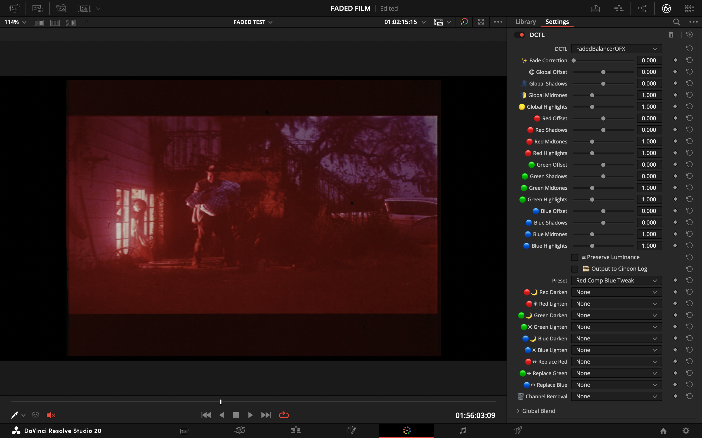
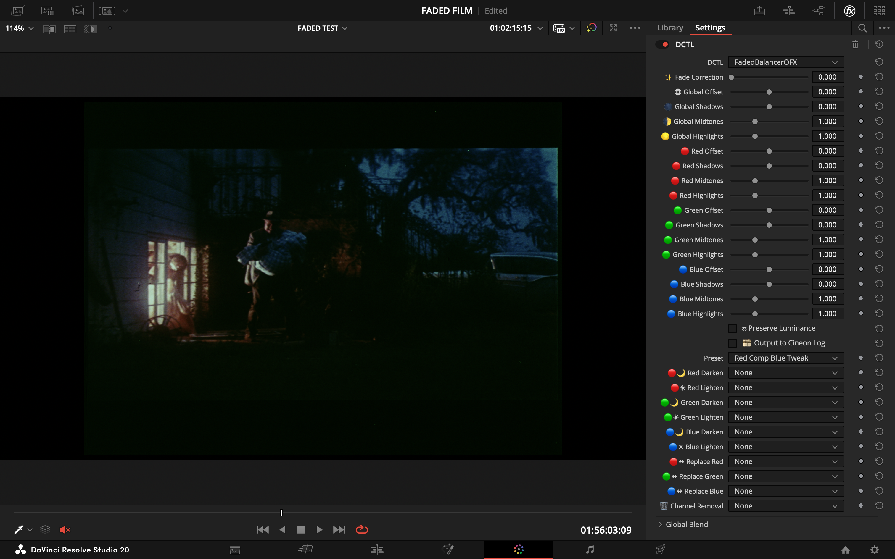

# Faded Balancer DCTL

  
  

  
  

  
   
  <small>
    Preferred: download the platform installer (<code>.pkg</code> or <code>.exe</code>) from
    <a href="https://github.com/fabiocolor/Faded-Balancer-DCTL/releases/latest">Latest Release</a>.
    Manual <code>.dctl</code> install is also available from Assets.
  </small>

  <a href="docs/BACKGROUND_FILM_FADING.md">Background & Science</a> •
  <a href="docs/presets_companion.md">Presets Companion</a> •
  <a href="docs/FAQ.md">FAQ</a> •
  <a href="https://github.com/fabiocolor/Faded-Balancer-DCTL/discussions">Discussions</a>

A DaVinci Resolve DCTL for balancing RGB channels and correcting faded film scans. It provides accessible and flexible tools for channel adjustment, mixing, and restoration preparation.

---

### Version

**Current: v1.6.0**

#### What's New in v1.6.0
- **Enhanced Channel Mixing**: Added shadow/highlight targeting for all channel mixing operations (matrix and darken/lighten)
  - **🎭 Mixing Shadows**: Control how much mixing affects shadow areas (0-1)
  - **🎭 Mixing Highlights**: Control how much mixing affects highlight areas (0-1)
  - **🎭 Donor Luminance**: Adjust brightness of source channel before mixing (0.1-3.0)
  - All three controls now affect both matrix mixing (e.g. Red from Green) and darken/lighten mixing (e.g. Red darken with Green)
  - Perfect for selective film restoration (e.g., repair blue damage only in shadows, or boost highlights with controlled donor brightness)
- **👁️ Channel Preview**: Toggle between Normal, Red Only, Green Only, Blue Only isolation modes
  - Essential for film restoration workflow - inspect individual channels without keybindings
- **Improved Pipeline**: Streamlined processing with better tonal masking algorithms

#### What's New in v1.5.0
- **New Channel Mixer**: RGB matrix mixing for advanced highlight recovery and channel reconstruction
- Cross-channel boost controls enable rebuilding clipped channels using data from other channels

#### What's New in v1.4.0
- Added non-destructive preset system (10 starter corrective presets; toggling back to None restores baseline UI state).
- Internal pipeline clarified (see Pipeline section) – ordering unchanged from spec; presets occur before global stage.
- Minor doc clarifications; no processing math changes versus v1.3.0.

#### What's New in v1.3.0
- Added `Preserve Luminance` (⚖) – normalizes luma after per-channel stage only (global adjustments still shift exposure).
- Renamed channel "Copy" operations to clearer **Replace** (e.g. "Replace Red → With Green").
- Locked processing order: Global → Fade Correction → Per-Channel → Mixing → Replace → Removal → Output.
- Consolidated UI/label/icon overhaul (option text simplification, Darken/Lighten composite combos, consistent icon set, duplicate definitions removed).

#### What's New in v1.2.0
- Removed final hard clamp to preserve full floating-point range during grading.
- Added `Output to Cineon Log` checkbox to inspect and balance channels safely without clipping.
- Added per-channel Offset controls (Red/Green/Blue) for finer pre-lift channel alignment.

---

### Features

-   **Film Fade Correction:** A dedicated tool to correct faded footage by adaptively enhancing contrast and saturation.
-   **Global & Per-Channel Balance:** Adjust Lift, Gamma, and Gain for all channels together or individually.
-   **Preserve Luminance (⚖):** Optional re-normalization of luma after per-channel adjustments.
-   **Channel Mixer & Highlight Boost:** RGB matrix mixing for highlight recovery (e.g., boost clipped red channel using green/blue data) plus Min/Max composites. 
    - **Donor Luminance, Mixing Shadows, and Mixing Highlights** affect both matrix mixing and darken/lighten mixing. This means you can control where and how strongly donor channels contribute to repairs, for all types of mixing.
    - Use these controls to target only shadows, only highlights, or adjust donor brightness for precise restoration.
-   **Enhanced Channel Mixing (v1.6.0):** Shadow/highlight targeting for precise tonal control of darken/lighten operations and matrix mixing.
-   **Channel Preview (v1.6.0):** Individual channel isolation (Red/Green/Blue Only) for inspection without keybindings.
-   **Channel Replace & Removal:** Replace a channel's data with another or remove a channel entirely.
-   **Optional Cineon Output:** Linear → Cineon-like log inspection mode.
-   **Presets (v1.4.0):** Non-destructive internal presets. See `docs/presets_companion.md` for details.

---

### Practical Usage Guidance

- **When to use Donor Luminance:**
  - If the donor channel is too bright and over-corrects, lower Donor Luminance (e.g. 0.7-0.9).
  - If the donor is too dark, increase Donor Luminance (e.g. 1.1-1.5).
  - This works for both matrix mixing and darken/lighten mixing.
- **When to use Mixing Shadows/Highlights:**
  - Set Mixing Shadows to 1.0 and Highlights to 0.0 to restrict repairs to shadow regions.
  - Set Mixing Highlights to 1.0 and Shadows to 0.0 to target only highlights.
  - Use both at intermediate values for smooth transitions.
- **All mixing controls (matrix and min/max) are affected by these settings.**
- **Channel Preview:** Use to inspect individual channels for damage before and after repairs.

---

### Pipeline (Processing Order)

The image is processed through the following steps in a fixed order:

1.  **🎨 Preset Application** (Internal temporary variables only)
2.  **🌍 Global Adjust** (Offset / Shadows / Midtones / Highlights)
3.  **✨ Fade Correction** (Contrast + Saturation nudge)
4.  **🎨 Per-Channel Adjust** (R/G/B)
5.  **⚖️ Optional Preserve Luminance** (Post per-channel only)
6.  **📈 Channel Mixer** (RGB matrix for highlight boost)
7.  **🎭 Enhanced Mixing** (Darken / Lighten with shadow/highlight targeting)
8.  **➡️ Replace** (Explicit channel copy)
9.  **❌ Removal** (Zero out channels)
10. **👁️ Channel Preview** (Isolation for inspection)
11. **📜 Optional Output to Cineon Log**

---

### Before & After

Here are a few examples showcasing the plugin's effectiveness in correcting faded film scans.

**Example 1: Night Scene**

| Before | After |
| :---: | :---: |
|  |  |

**Example 2: Boy Scene**

| Before | After |
| :---: | :---: |
|  |  |

**Example 3: Captain Scene**

| Before | After |
| :---: | :---: |
|  |  |

**Example 4: Beach Scene**

| Before | After |
| :---: | :---: |
|  |  |

**Example 5: Table Scene**

| Before | After |
| :---: | :---: |
|  |  |

---

### Installation

**Recommended: Easy installers (single package per platform):**

- **Windows:** Download `FadedBalancerDCTL-Setup-x.x.x.exe` from the [Latest Release](https://github.com/fabiocolor/Faded-Balancer-DCTL/releases/latest) assets. Run it to install (accept UAC when prompted). To uninstall: use “Uninstall Faded Balancer DCTL” from Start Menu or Settings → Apps, or run the same `.exe` again and choose Uninstall.
- **macOS:** Download `FadedBalancerDCTL-x.x.x.pkg` from the [Latest Release](https://github.com/fabiocolor/Faded-Balancer-DCTL/releases/latest) assets. Double-click to install (admin password required). Double-click the same `.pkg` again to uninstall.

The installers are unsigned; your system may show a security warning (e.g. Windows “Run anyway”, macOS right-click → Open or Security & Privacy → “Open Anyway”).

**Alternative: Manual install (.dctl file):**

1.  Download `FadedBalancerDCTL.dctl` from the Releases page:
    - Direct: [Latest `.dctl` download](https://github.com/fabiocolor/Faded-Balancer-DCTL/releases/latest/download/FadedBalancerDCTL.dctl)
    - Releases: [Latest Release](https://github.com/fabiocolor/Faded-Balancer-DCTL/releases/latest) (download the `.dctl` from Assets)
2.  Place it in your DaVinci Resolve LUT folder:
	-   **Windows:** `C:\ProgramData\Blackmagic Design\DaVinci Resolve\Support\LUT\`
	-   **macOS:** `/Library/Application Support/Blackmagic Design/DaVinci Resolve/LUT/`
3.  Restart DaVinci Resolve.
4.  In the Color page, add a "DCTL" effect to a node and select `FadedBalancerDCTL` from the dropdown menu.

---

### Sample Footage

- Download test footage to try the DCTL quickly: [Archive.org — Film BAR: 70 Trailers Reel (1440x1080, 24fps)](https://archive.org/details/film-bar-70-trailers-reel-1440x-1080-24fps)

---

### Video Demonstration

For a visual guide on how to use the plugin, check out the video tutorial below:

---

### Community & Support

-   **Discussions:** Share ideas, ask questions, or suggest features in the [GitHub Discussions](https://github.com/fabiocolor/Faded-Balancer-DCTL/discussions).
-   **Contact:** For direct inquiries, you can reach out via [Email](mailto:info@fabiocolor.com) or connect on [Instagram](https://www.instagram.com/fabiocolor), [LinkedIn](https://www.linkedin.com/in/fabiobedoya/), or [YouTube](https://www.youtube.com/@fabiocolor).

If you find this plugin useful and would like to support its ongoing development, please consider making a donation. Your support is greatly appreciated!

  
  

---

### Acknowledgements

The "Film Fade Correction" feature was partially inspired by insights from the following paper:
-   Trumpy, G., Flueckiger, B., & Goeth, A. (2023). *Digital Unfading of Chromogenic Film Informed by Its Spectral Densities*. [Link to paper](https://ntnuopen.ntnu.no/ntnu-xmlui/handle/11250/3101572)

---

### License

[MIT License](LICENSE)
