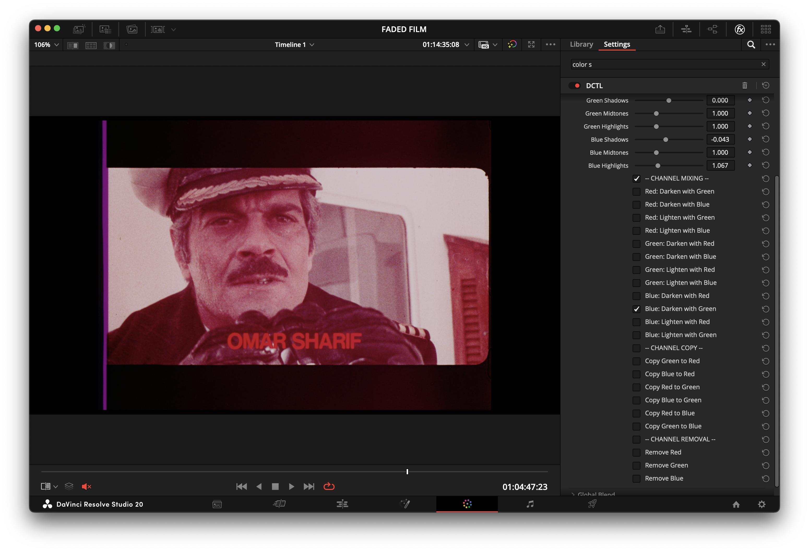

# FadedBalancerOFX - Background & Science

  <a href="../README.md">Home</a> •
  <a href="presets_companion.md">Presets Companion</a> •
  <a href="FAQ.md">FAQ</a>

---

### The Science of Film Fading

This document provides a brief, practical overview of why color film fades and the strategies FadedBalancerOFX employs to correct it.

### How Color Film Works

Most color motion picture film is **chromogenic**, meaning it creates color through a chemical process. It consists of multiple layers, but for the purpose of color, three are key. Each layer is sensitive to a primary color of light, and during development, it forms a dye of the complementary color.

| Light Sensitivity | Forms Dye |
| :---: | :---: |
| 🔵 Blue | 🟡 Yellow |
| 🟢 Green | 🟣 Magenta |
| 🔴 Red | 🇨🇳 Cyan |

These three dyes (Cyan, Magenta, Yellow) are organic and inherently unstable. Over time, they chemically break down, causing the image to fade and shift in color.

### The "Magenta Cast" Problem

While all dyes are unstable, the **cyan and yellow dyes are notoriously less stable** than the magenta dye. As they deteriorate at a faster rate, the image loses its blue and green information, leaving the more stable magenta dye to dominate the color balance.

This phenomenon is especially common in certain film stocks, such as the Eastman color prints that were widely distributed in the 1970s and 1980s. The result is a characteristic **strong red or magenta cast**.

This is the single most common type of color degradation in archival film, and it is the primary problem FadedBalancerOFX is designed to solve.

**Example of Faded Film with a Magenta Cast:**

### Corrective Strategies in FadedBalancerOFX

Because the original dye information is permanently lost from the film, a true restoration of the original colors is impossible. Instead, the goal is to **re-balance the remaining color channels** to achieve a neutral, believable image. This process is a form of digital approximation, using the remaining data to make an informed "guess" at the intended look.

#### 1. Reduce the Dominant Channel
The most direct approach is to reduce the strength of the red channel to bring it back in line with the green and blue channels.
> - **Tools:** The per-channel `Red` sliders (Shadows, Midtones, Highlights) and several presets (`Strong Red Compress`, `Red Compress Mid`) are designed for this purpose.

#### 2. Channel Mixing & Replacement
In severe cases, the red channel may be too noisy, clipped, or degraded to be useful on its own. In these situations, we can "borrow" information from a healthier channel.
> - **Mixing:** Operations like `Red = min(Red, Green)` can effectively darken the red channel where it appears unnaturally bright, reducing the color cast.
> - **Replacement:** A more drastic step, `Red -> Green`, replaces the red channel's data entirely with the green channel's. This is highly effective at removing the cast but will alter the scene's original color palette.

#### 3. The Fade Correction Algorithm
The `Fade Correction` slider is an adaptive tool that analyzes the image to intelligently boost contrast and saturation.
> - **Purpose:** It is designed to counteract the washed-out, low-contrast look that is typical of faded film. It serves as an excellent first step before making fine-tuned manual adjustments to individual color channels.

---

  <a href="../README.md">Back to Home</a>

