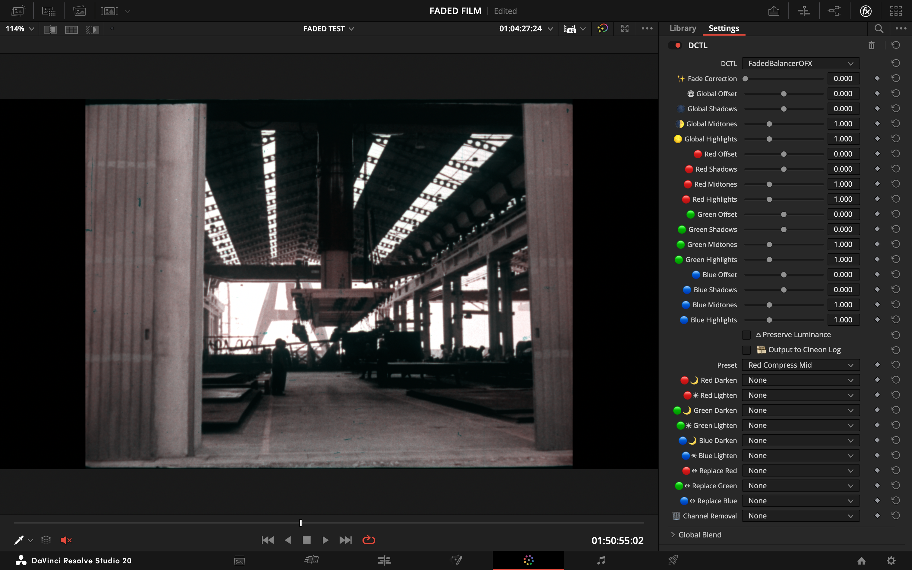
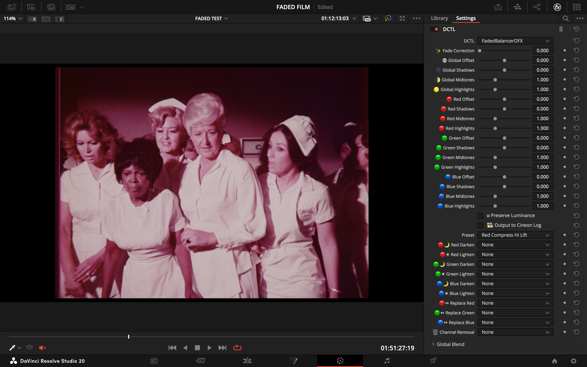
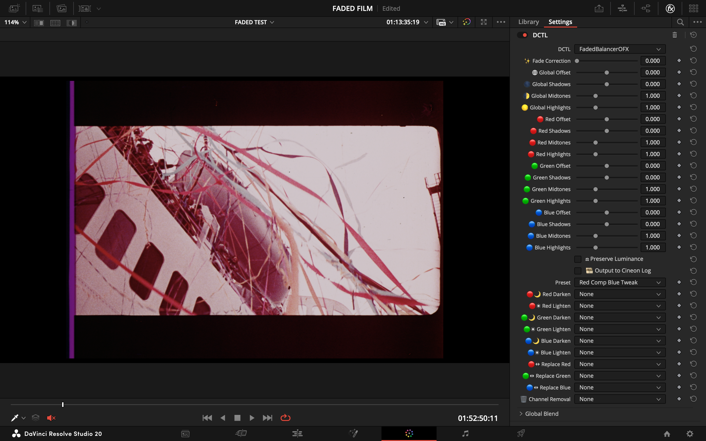
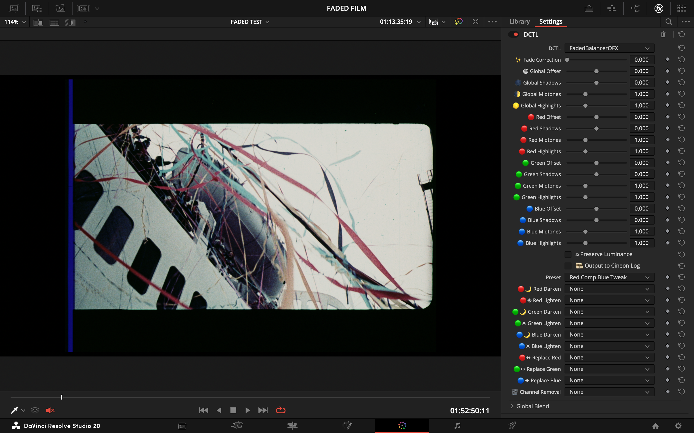
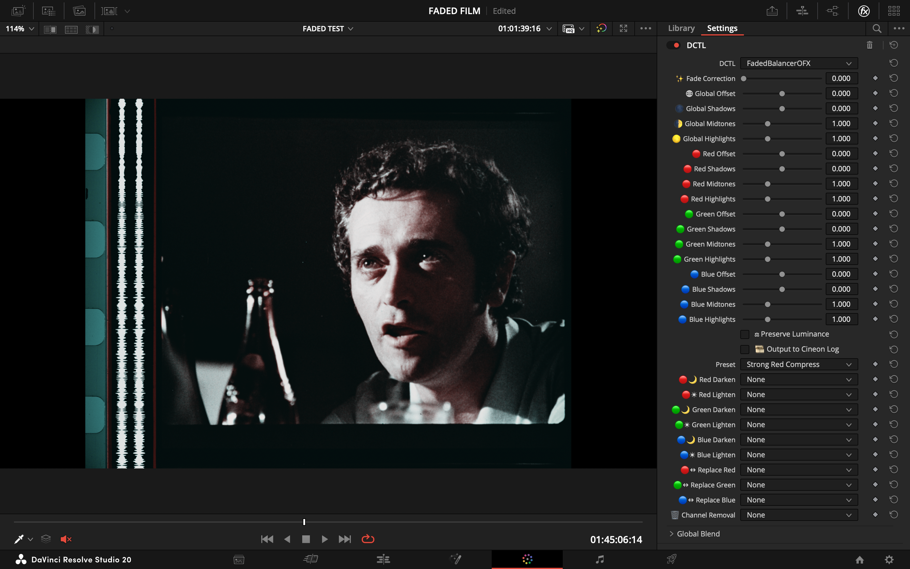
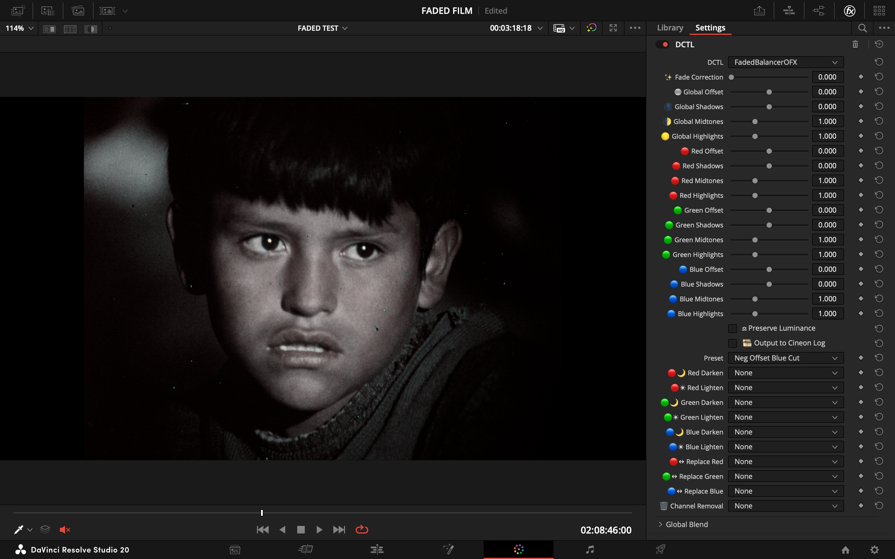
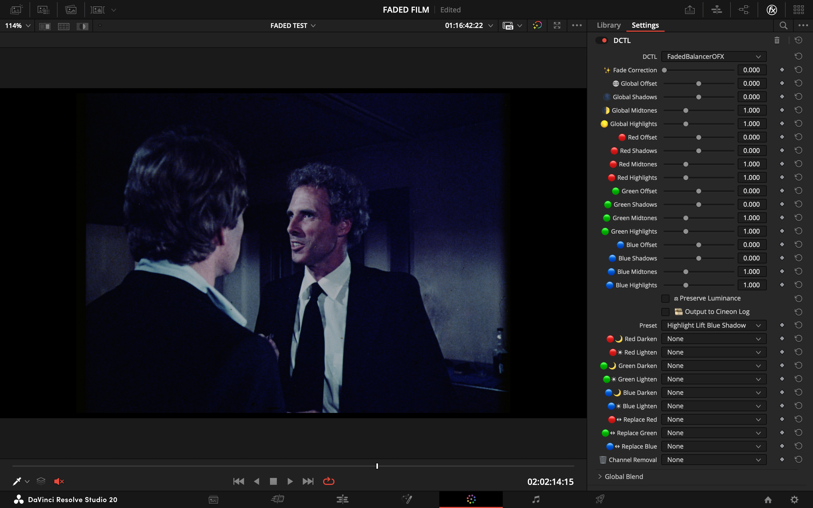
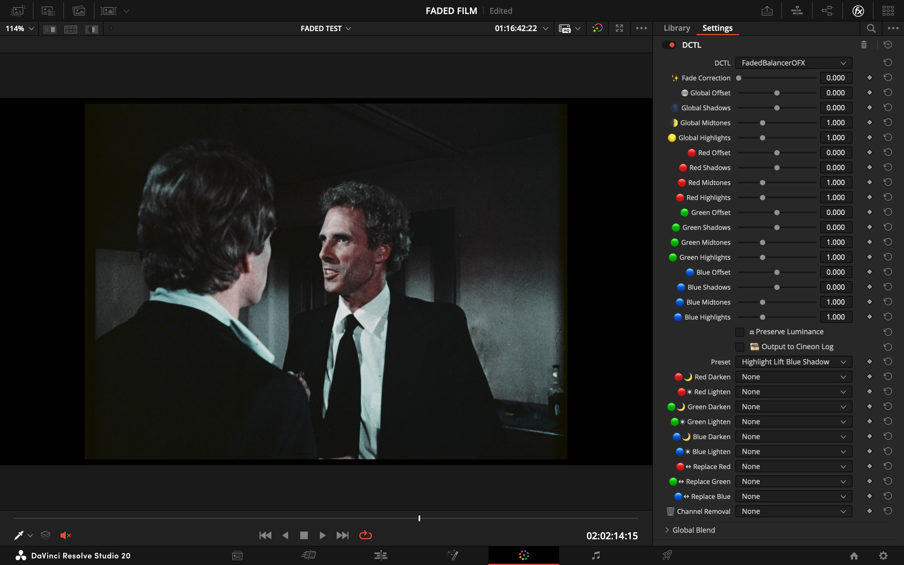

# Presets Companion

Presets provide non‑destructive starting points for common fade scenarios. Select a preset, then refine controls as needed. UI values are not overwritten.

Notes:
- "Red Compress": reduce red mids/highs where cyan loss dominates.
- "Balanced/Neutral": small shaping only.
- "Heavy Red Crush": strong rescue; monitor clipping.
- "Neg Offset Blue Cut": slight overall dip plus blue shadow reduction.
- "Highlight Lift Blue Shadow": modest highlight lift and blue shadow softening.

---

## Preset List (1 → 10)

### 1. Red Compress Mid
Mild red mid control for common magenta shifts.

| Before | After |
| :---: | :---: |
|  |  |

### 2. Balanced Aggregate
Neutral baseline.

| Before | After |
| :---: | :---: |
|  |  |

### 3. Red Compress Hi Lift
Red compress with modest highlight lift.

| Before | After |
| :---: | :---: |
|  |  |

### 4. Red Comp Blue Tweak
Adds a small blue shadow dip.

| Before | After |
| :---: | :---: |
|  |  |

### 5. Heavy Red Crush
Strong red mid compression with highlight gain (watch clipping).

| Before | After |
| :---: | :---: |
|  |  |

### 6. Mild Corrective
Small overall correction with softer highlights.

| Before | After |
| :---: | :---: |
|  |  |

### 7. Neutral Red Mid Tweak
Near‑neutral with light red mid compression.

| Before | After |
| :---: | :---: |
|  |  |

### 8. Strong Red Compress
Deeper red compression for heavier fades.

| Before | After |
| :---: | :---: |
|  |  |

### 9. Neg Offset Blue Cut
Slight negative offset plus blue shadow suppression.

| Before | After |
| :---: | :---: |
|  |  |

### 10. Highlight Lift Blue Shadow
Gentle highlight lift and softened blue shadows.

| Before | After |
| :---: | :---: |
|  |  |

---

## Selection & Use
- If unsure, start with 2 (Balanced).
- Strong magenta: 1, 3, or 8.
- Dull highlights: 3 or 10.
- Cool/noisy blue shadows: 4, 9, or 10.
- Severe red loss: 5, then refine carefully.

After choosing:
1) Fade Correction 0.10–0.30 (typical) for midtone lift.
2) Enable Preserve Luminance if brightness drifts.
3) Adjust per‑channel Midtones before heavy offset/highlight moves.
4) Use Darken mixes only when one channel spikes.

Verification:
- Parade neutral, no clipping (check Cineon view), memory colors reasonable.

## Share a Preset
Email **info@fabiocolor.com** with subject "Preset submission" and include either a short text of changed parameters or a UI screenshot. Include license/consent (e.g., CC0 or attribution preference).
